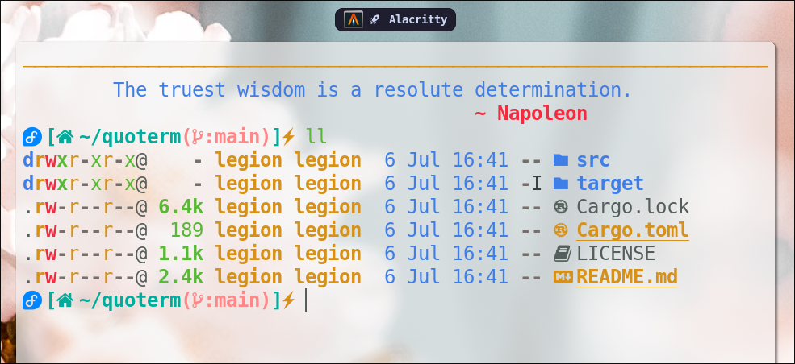

# 🗨️ Quoterm
A CLI tool for Greeting you with beautiful quotes around the day.



## 📖 Table of Contents

- [✨ Features](#features)
- [🚀 Installation](#installation)
- [🛠️ Usage](#usage)
- [🗑️ Uninstall](#uninstall)
- [🐛 Bugs or Requests](#bugs-or-requests)
- [🤝 Contributing](#contributing)
- [📄 License](#license)
- [🙏 Acknowledgments](#acknowledgments)

## ✨ Features

- **Quotes**: Greets you with random quotes everytime you open your terminal.
- **Reactive**: Formatting changes based on the width of your terminal.
- **Stay Motivated**: Get motivational & thought provoking quotes.

## 🚀 Installation
> Please note that you should have [Rust](https://rust-lang.org) installed on your system.

- Clone this repo using
```bash
git clone http://github.com/jollySleeper/quoterm.git ~/quoterm && cd ~/quoterm
```

- Run these commands to install
```bash
cargo build --release
cargo install --path .
```

## 🛠️ Usage
> Please add `~/.cargo/bin/` to your PATH

- Add the following snippet to your shell rc file at the end.
```sh .bashrc/.zshrc
if type "quoterm" > /dev/null; then
    quoterm 
fi
```

## 🗑️ Uninstall

Sorry to hear that this project didn't meet your expectations. Please help us with your feedback.
For uninstalling run `rm ~/.cargo/bin/quoterm` from terminal and delete the Quoterm foler using `rm -r quoterm` command.

## 🐛 Bugs or Requests

If you encounter any problem(s) feel free to open an [issue](https://github.com/jollySleeper/quoterm/issues/new).
If you feel the project is missing a feature, please raise an [issue](https://github.com/jollySleeper/quoterm/issues/new) with `FeatureRequest` as heading.

## 🤝 Contributing

Contributions are welcome! Please follow these steps:

1. Fork the repository.
2. Create a new branch (`git checkout -b feature/YourFeature`).
3. Make your changes and commit them (`git commit -m 'Add some feature'`).
4. Push to the branch (`git push origin feature/YourFeature`).
5. Open a pull request.

## 📄 License

This project is licensed under the MIT License - see the [LICENSE](https://github.com/jollySleeper/quoterm/blob/main/LICENSE) file for details.

## 🙏 Acknowledgments

- This Project takes inspiration from [Please](https://github.com/NayamAmarshe/please) and many other similar projects.
- The quotes displayed by this CLI tools is provided by the JSON File in [Please](https://github.com/NayamAmarshe/please).
